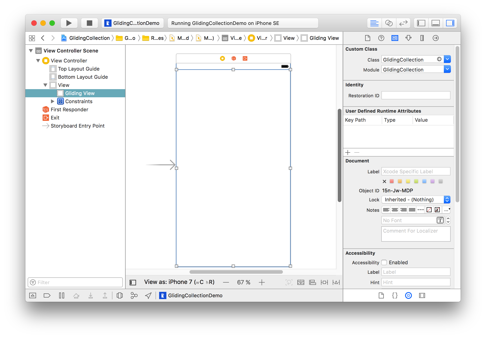
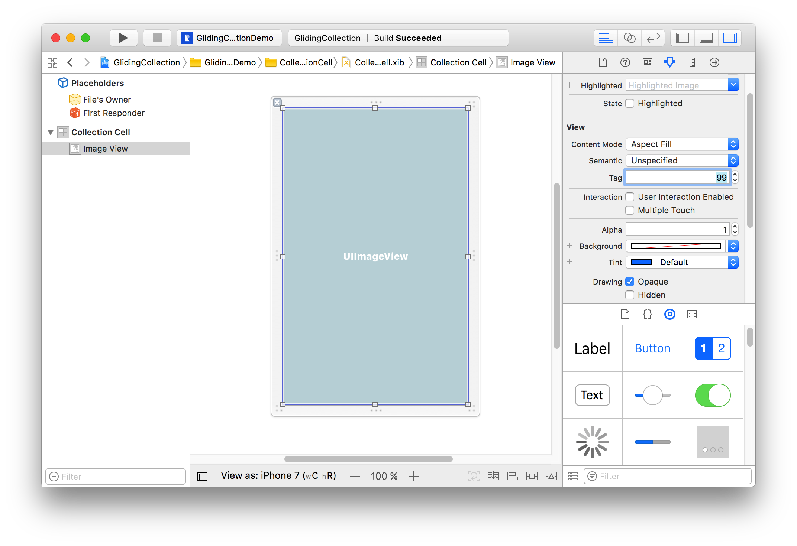

<a href="https://github.com/Ramotion/gliding-collection">
</a>

<p><h1 align="left">GLIDING COLLECTION</h1></p>

<h4>A smooth, flowing, customizable decision for a UICollectionView Swift Controller</h4>


___


<p><h6>We specialize in the designing and coding of custom UI for Mobile Apps and Websites.</h6>
<a href="https://dev.ramotion.com?utm_source=gthb&utm_medium=repo&utm_campaign=gliding-collection">
</a>
</p>
<p><h6>Stay tuned for the latest updates:</h6>
<a href="https://goo.gl/rPFpid" >
</a></p>
<h6><a href="https://store.ramotion.com/product/iphone-x-clay-mockups?utm_source=gthb&utm_medium=special&utm_campaign=gliding-collection#demo">Get Free Mockup For your project →</a></h6>

</br>

[](http://twitter.com/Ramotion)
[](https://cocoapods.org/pods/GlidingCollection)
[](http://cocoapods.org/pods/GlidingCollection)
[](https://cdn.rawgit.com/Ramotion/gliding-collection/master/docs/index.html)
[](https://github.com/Ramotion/gliding-collection)
[](https://codebeat.co/projects/github-com-ramotion-gliding-collection)

[](https://paypal.me/Ramotion)

## Requirements

- iOS 8.0+
- Xcode 8
- Swift 3 (<= 1.0.3)
- Swift 4 (>= 1.1.0)
- Swift 4.2 (~> 2.0)

<br>

## Installation
You can install `GlidingCollection` in several ways:

- Add source files to your project.

<br>

- Use [CocoaPods](https://cocoapods.org):
``` ruby
pod 'GlidingCollection'
```

<br>

- Use [Carthage](https://github.com/Carthage/Carthage):
```
github "Ramotion/gliding-collection"
```

<br>

## How to use

• Create a view controller class:

```swift
import GlidingCollection

class ViewController: UIViewController {
  let items = ["gloves", "boots", "bindings", "hoodie"]
}
```

• Drag a `UIView` onto the canvas. Change it's class to `GlidingCollection` and use autolayout constraints.



• Connect this view to your view controller class as an `@IBOutlet`.

```swift
@IBOutlet var glidingCollection: GlidingCollection!
```

• Make your view controller conform to `GlidingCollectionDatasource`. It's very similar to the `UITableView` or `UICollectionView` *datasource* protocols that you know:

```swift
extension ViewController: GlidingCollectionDatasource {

  func numberOfItems(in collection: GlidingCollection) -> Int {
    return items.count
  }

  func glidingCollection(_ collection: GlidingCollection, itemAtIndex index: Int) -> String {
    return "– " + items[index]
  }

}
```

• Make your view controller conform to `UICollectionViewDatasource`:

```swift
extension ViewController: UICollectionViewDatasource {
  
  func collectionView(_ collectionView: UICollectionView, numberOfItemsInSection section: Int) -> Int {
    let section = glidingView.expandedItemIndex // Value of expanded section.
    return images[section].count
  }
  
  func collectionView(_ collectionView: UICollectionView, cellForItemAt indexPath: IndexPath) -> UICollectionViewCell {
    guard let cell = collectionView.dequeueReusableCell(withReuseIdentifier: "Cell", for: indexPath) as? CollectionCell else { return UICollectionViewCell() }
    // Configure and return your cell.
    return cell
  }
  
}
```

## Customize

You can customize the appearance of `GlidingCollection` by overriding `GlidingConfig`'s `shared` instance with your own.

```swift
var config = GlidingConfig.shared
config.buttonsFont = UIFont.boldSystemFont(ofSize: 22)
config.activeButtonColor = .black
config.inactiveButtonsColor = .lightGray
GlidingConfig.shared = config
```

>🗒 All parameters with their descriptions are listed in [`GlidingConfig`](/GlidingCollection/GlidingConfig.swift).

<br>

## Notes

There is a [`GlidingCollectionDelegate`](/GlidingCollection/Protocols/GlidingCollectionDelegate.swift) protocol which can notify you when *item* in `GlidingCollection` `didSelect`, `willExpand` and `didExpand`.

If you want to achieve a parallax effect on a horizontal cards stack, you need to place your `parallax view` in a cell's `contentView` and set its `tag` to `99`.



There is a `kGlidingCollectionParallaxViewTag` constant if you want to layout a cell in code.
```swift
imageView.tag = kGlidingCollectionParallaxViewTag
```

## 📄 License

Gliding Collection is released under the MIT license.
See [LICENSE](./LICENSE) for details.

This library is a part of a <a href="https://github.com/Ramotion/swift-ui-animation-components-and-libraries"><b>selection of our best UI open-source projects.</b></a>

If you use the open-source library in your project, please make sure to credit and backlink to www.ramotion.com

## 📱 Get the Showroom App for iOS to give it a try
Try this UI component and more like this in our iOS app. Contact us if interested.

<a href="https://itunes.apple.com/app/apple-store/id1182360240?pt=550053&ct=gliding-collection&mt=8" >
</a>

<a href="https://dev.ramotion.com?utm_source=gthb&utm_medium=repo&utm_campaign=gliding-collection">
</a>
<br>
<br>

